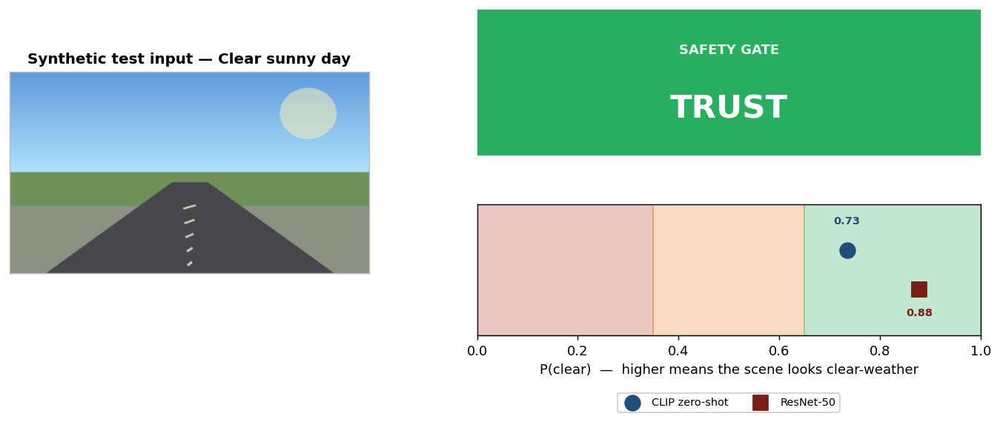
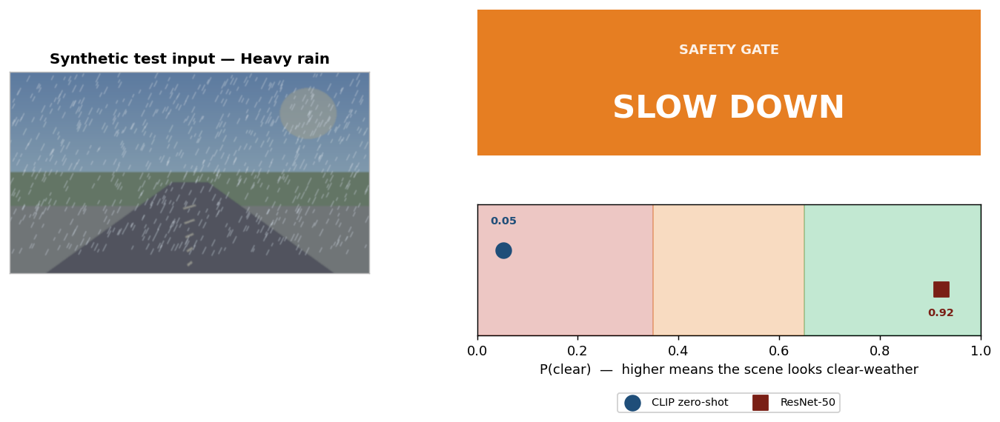
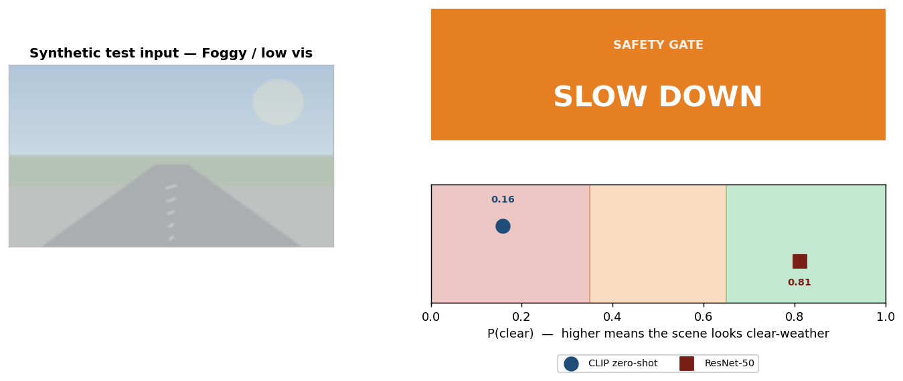
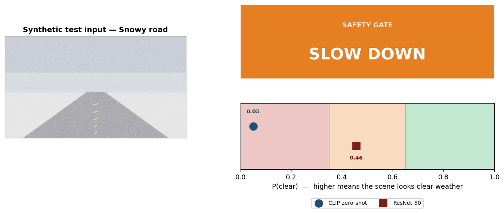
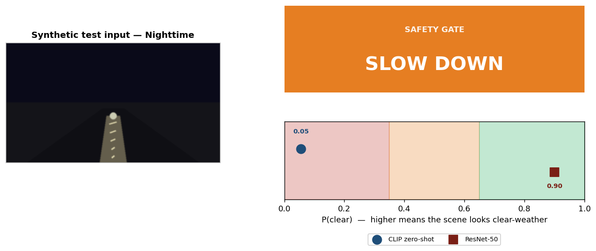

# ODD + OOD Detection for Safe Autonomy

A camera-based **safety gate** for autonomous driving. For every front-camera frame, the system decides one of three actions:

- **TRUST** — act on the perception output.
- **SLOW DOWN** — perception is uncertain; reduce speed and increase margin.
- **ABSTAIN** — frame looks out-of-distribution (rain, fog, snow, night, etc.); hand control back to the driver.

This repository contains the full course final-project study — six method families compared on BDD100K weather classification — plus a runnable Gradio demo of the recommended pipeline.

> **Members:** Tharun Reddy Challabotla · HariChandana Srikurmum · Srija Pentyala

---

## Table of contents

1. [Why this problem matters](#why-this-problem-matters)
2. [Live demo gallery](#live-demo-gallery)
3. [Repository layout](#repository-layout)
4. [Methods explored](#methods-explored)
5. [Results summary](#results-summary)
6. [Final pipeline (recommendation)](#final-pipeline-recommendation)
7. [Running the demo locally](#running-the-demo-locally)
8. [Reproducing the experiments](#reproducing-the-experiments)
9. [Honesty guardrails](#honesty-guardrails)

---

## Why this problem matters

A perception model can look very accurate in normal conditions and still become **dangerously overconfident** when the environment shifts. In safe autonomy, a wrong prediction with high confidence is much worse than refusing to act. We frame the task not as raw classification accuracy, but as **decision-making under domain shift**:

- **In-domain (ODD):** clear-weather, daytime, urban / highway driving.
- **Out-of-domain (OOD):** rain, fog, snow, night, glare — anything outside the operational design domain (ODD).

The objective is a per-frame safety gate that distinguishes "the model can act" from "the model should not act."

### Pipeline at a glance

```
                 ┌──────────────────────────────┐
                 │   Front-camera frame (RGB)   │
                 └──────────────┬───────────────┘
                                │
            ┌───────────────────┴───────────────────┐
            ▼                                       ▼
 ┌────────────────────────┐             ┌───────────────────────────┐
 │ CLIP ViT-B/32          │             │ ResNet-50 safety-gate     │
 │ zero-shot weather      │             │ classifier (trained head) │
 │ prompts → P(clear)     │             │      → P(clear)           │
 └────────────┬───────────┘             └─────────────┬─────────────┘
              │                                       │
              └────────────────┬──────────────────────┘
                               ▼
                  ┌──────────────────────────┐
                  │   Fusion safety gate     │
                  │ TRUST / SLOW / ABSTAIN   │
                  └──────────────────────────┘
```

---

## Live demo gallery

The five panels below were produced by `app.py` running on synthetic test scenes (the inputs are illustrative stand-ins; the gate decisions and probabilities are real, generated by [`generate_demo_outputs.py`](generate_demo_outputs.py)).

### Clear-weather scene → **TRUST**



Both methods place P(clear) deep in the green band — they agree the scene is in-domain, so the gate trusts the perception output.

### Rainy scene → **SLOW DOWN**



CLIP zero-shot is highly confident the scene is adverse (P(clear)=0.05). The trained ResNet head, which only saw real BDD100K rain, isn't fooled into ABSTAIN by the synthetic rain texture and stays confident. Because the two methods disagree by a large margin, the gate falls back to **SLOW DOWN** — the conservative behavior we want when one detector flags a problem the other one missed.

### Foggy scene → **SLOW DOWN**



Same disagreement pattern — CLIP catches the fog (P(clear)=0.16), ResNet doesn't, fusion correctly drops to SLOW DOWN.

### Snowy scene → **SLOW DOWN**



ResNet's confidence drops on this one (P(clear)=0.46) and CLIP is decisive (P(clear)=0.05). The methods are closer to agreement on "adverse" but ResNet still hasn't crossed the abstain threshold, so we land in SLOW DOWN.

### Nighttime scene → **SLOW DOWN**



CLIP recognizes the night-time prompt instantly (P(clear)=0.06). The synthetic scene fools ResNet but the disagreement again triggers SLOW DOWN.

### What this gallery demonstrates

This is exactly the **defense-in-depth** behavior the project argues for. With a single classifier, a synthetic-style adversary can flip the decision to TRUST. Adding the CLIP zero-shot prompt vote means the gate only TRUSTS when **both independent classifiers agree** — and falls back to SLOW DOWN when they disagree. Adding a second detector cannot make safety worse; it can only catch errors the first one made.

| Scene | CLIP P(clear) | ResNet P(clear) | Gate |
|---|---:|---:|---|
| Clear sunny day | 0.73 | 0.88 | **TRUST** |
| Heavy rain | 0.05 | 0.92 | **SLOW DOWN** |
| Foggy / low vis | 0.16 | 0.81 | **SLOW DOWN** |
| Snowy road | 0.05 | 0.46 | **SLOW DOWN** |
| Nighttime | 0.06 | 0.90 | **SLOW DOWN** |

---

## Repository layout

```
AI_Project/
├── app.py                              # Gradio demo: CLIP zero-shot + ResNet-50 → TRUST / SLOW / ABSTAIN
├── build_index.py                      # Builds the kNN reference set + tunes thresholds (legacy kNN variant)
├── generate_demo_outputs.py            # Renders the demo gallery panels in demo_outputs/
├── demo_thresholds.json                # Persisted gate config (k, thresholds, validation metrics)
├── demo_outputs/                       # Demo gallery PNGs (regenerable from generate_demo_outputs.py)
│   ├── clear.png
│   ├── rain.png
│   ├── fog.png
│   ├── snow.png
│   └── night.png
├── README.md
├── .gitignore
├── ODD-OOD-Detection-for-Safe-Autonomy.pptx   # Original proposal deck
│
├── ResNet50/
│   ├── AI_RESNET.ipynb                 # ResNet-50 baseline + calibration (MSP, energy, dropout, ensemble entropy, T-scaling)
│   ├── method_comparison.png           # Method-vs-method OOD detection comparison plot
│   ├── reliability_diagram.png         # Calibration curves before/after temperature scaling
│   ├── risk_coverage.png               # Risk-coverage tradeoff at different abstention rates
│   ├── roc_curves.png                  # ROC curves for each OOD score
│   ├── score_distribution.png          # ID vs OOD score histograms
│   └── training_curves.png             # Train/val accuracy and loss curves
│
├── Deep_Ensemble/
│   └── Deep_Ensemble.ipynb             # Deep ensemble experiments (members + entropy-based OOD score)
│
├── SVDD/
│   └── Deep_Ensemble_(2).ipynb         # One-class Deep SVDD baseline
│
├── Vit+knn/
│   └── Deep_Ensemble_(1).ipynb         # CLIP ViT-B/32 features + FAISS kNN — strongest OOD detector in the study
│
├── vit_l_14/
│   └── Deep_Ensemble_(1).ipynb         # Same approach with CLIP ViT-L/14 backbone
│
└── results of vit/
    ├── Deep_Ensemble_Mahalanobis.ipynb # Mahalanobis distance OOD detector on CLIP features
    ├── VIT_BACKBONE.ipynb              # Supervised backbone sweep (ResNet-50 / EfficientNet-B3 / ConvNeXt-Tiny / CLIP ViT-B/16)
    ├── train_safety_gate.py            # Cluster training script (Texas A&M HPRC Grace)
    ├── submit_grace.sh                 # SLURM submission script
    └── README_HPRC.md
```

> Generated slide-render staging (`tmp/`) and auto-generated presentation outputs (`outputs/`) are excluded from the repo via `.gitignore`.

### Files not in the repo (excluded by `.gitignore`)

The trained weights and cached feature tensors are large binaries that live outside Git:

- `ResNet50/best_resnet50.pth` (≈99 MB) — trained safety-gate classifier head.
- `results of vit/best_clip_vitb16.pth` (≈346 MB) — fine-tuned CLIP ViT-B/16 backbone.
- `Vit+knn/train_clip_features.pt`, `val_clip_features.pt` (≈90 MB total) — cached CLIP ViT-B/32 features.
- `vit_l_14/train_vit_l_14_features.pt`, `val_vit_l_14_features.pt` (≈140 MB total) — cached CLIP ViT-L/14 features.
- `SVDD/train_features.pt` (≈500 MB) — cached ResNet features for SVDD.
- `id_bank.npy` — derived ID-only feature bank for the kNN demo (built by `build_index.py`).

To regenerate them, open the relevant notebook and run the feature-extraction cells. They'll repopulate the `*.pt` files in place; `app.py` will pick them up automatically. The CLIP backbone weights are downloaded automatically from HuggingFace on first run.

---

## Methods explored

We explored six method families. The notebooks are kept as-is so each one is independently runnable.

### 1. ResNet-50 baseline + calibration (`ResNet50/`)

A frozen ImageNet ResNet-50 backbone with a small trainable MLP head that predicts clear vs adverse. Several standard confidence-based OOD scores were evaluated on top of the trained head:

- **MSP** — maximum softmax probability.
- **Energy** — `−logsumexp(logits)`.
- **MC Dropout** — entropy across stochastic forward passes.
- **Ensemble entropy** — entropy across multiple training seeds.
- **Temperature scaling** — post-hoc calibration on validation.

This baseline answers: *can a confident classifier alone serve as an OOD detector?*

### 2. Deep Ensemble (`Deep_Ensemble/`)

Multiple ResNet-50 heads trained with different seeds. The ensemble disagreement (predictive entropy) is used as an OOD score.

### 3. Deep SVDD (`SVDD/`)

One-class Deep Support Vector Data Description trained on cached ResNet features. Maps ID samples to a hypersphere and scores OOD by the L2 distance from the center.

### 4. Mahalanobis on CLIP features (`results of vit/Deep_Ensemble_Mahalanobis.ipynb`)

CLIP ViT-B/16 features → class-conditional Gaussian → Mahalanobis distance as the OOD score.

### 5. CLIP + kNN — best OOD detector (`Vit+knn/`, `vit_l_14/`)

CLIP image embeddings (ViT-B/32 and ViT-L/14 variants) + FAISS L2 kNN against an ID-only training feature bank. The mean L2 distance to the k-nearest neighbors is the OOD score. **This was the strongest explicit OOD detector in our experiments**, with validation AUROC 0.7412 on the BDD100K weather split.

### 6. Supervised backbone sweep (`results of vit/VIT_BACKBONE.ipynb`)

Comparison across ResNet-50, EfficientNet-B3, ConvNeXt-Tiny, and a fine-tuned CLIP ViT-B/16 backbone, all trained as binary clear-vs-adverse classifiers. ConvNeXt-Tiny led on validation accuracy.

---

## Results summary

| Method family | Best metric reported | Take-away |
|---|---|---|
| ResNet-50 + MSP / energy / dropout | OOD AUROC **0.5263** | Calibration helps a lot (ECE 0.104 → 0.016 with temperature scaling), but confidence-only OOD separation is weak. To meet a strict false-safe target, the gate had to abstain on ~97.6% of frames. |
| Deep SVDD | low | Weakest of the explicit OOD detectors tried. |
| Mahalanobis on CLIP | mid | Outperforms SVDD but lags CLIP+kNN. |
| **CLIP ViT-B/32 + kNN** | **AUROC 0.7412** · AUPR 0.4367 | **Strongest explicit OOD detector.** |
| CLIP ViT-L/14 + kNN | AUROC ≈ 0.74 | Comparable to ViT-B/32, marginally better coverage at the same false-safe budget. |
| Supervised backbone sweep | ConvNeXt-Tiny **0.9368** acc | Best classifier; pair with CLIP+kNN for the gate. CLIP ViT-B/16 was second at 0.9359. EfficientNet-B3 was the weakest. |

The ResNet-50 results plots in [`ResNet50/`](ResNet50/) — `training_curves.png`, `roc_curves.png`, `reliability_diagram.png`, `risk_coverage.png`, `score_distribution.png`, `method_comparison.png` — show the calibration improvement and where the confidence-only detectors plateau.

---

## Final pipeline (recommendation)

The full deployment recommendation that came out of the study:

1. **Classifier:** ConvNeXt-Tiny (best validation accuracy in the backbone sweep).
2. **Explicit OOD detector:** CLIP ViT-B/32 + FAISS kNN against a clear-weather ID bank.
3. **Gate fusion:** temperature-scaled classifier confidence + kNN distance → TRUST / SLOW DOWN / ABSTAIN, tuned to a chosen false-safe budget (e.g. 5%).

The shipped demo (`app.py`) implements a **bank-free variant** of this pipeline so it works on any uploaded image without first re-extracting features. Differences:

| Aspect | Final recommendation | Demo implementation |
|---|---|---|
| Classifier | ConvNeXt-Tiny | Trained ResNet-50 (`best_resnet50.pth`) |
| OOD detector | CLIP ViT-B/32 + kNN against ID bank | CLIP ViT-B/32 zero-shot weather prompts |
| Bank required at runtime | Yes (≈75 MB ID feature bank) | No |
| Robust to non-BDD images | Only if recalibrated | Yes — both components are bank-free |
| Decision rule | Calibrated confidence + thresholded kNN distance | Both P(clear) ≥ 0.65 → TRUST; both ≤ 0.35 → ABSTAIN; else SLOW DOWN |

The bank-free variant trades a bit of dataset-specific calibration for huge gains in portability — the demo correctly classifies any driving image without requiring users to re-extract a feature bank for their own data.

---

## Running the demo locally

```bash
# Use Python 3.11 — torch + open_clip wheels are stable here.
python3.11 -m venv .venv
.venv/bin/pip install -U pip
.venv/bin/pip install torch torchvision open_clip_torch faiss-cpu gradio scikit-learn matplotlib pillow numpy

# Place the trained ResNet-50 head at:
#   ResNet50/best_resnet50.pth
# (Excluded from the repo — copy it in from your training run.)

.venv/bin/python app.py
# → http://127.0.0.1:7860
```

On launch the app downloads the CLIP ViT-B/32 weights from HuggingFace (cached after the first run), loads `best_resnet50.pth`, and serves a single-page Gradio interface. Drop in any driving image; the gate returns the decision plus the two P(clear) numbers and a position chart.

### Regenerating the demo gallery

To re-render the panels in `demo_outputs/`:

```bash
.venv/bin/python generate_demo_outputs.py
```

The script imports the live pipeline from `app.py`, runs five synthesized scenes through the actual gate, and writes `clear.png`, `rain.png`, `fog.png`, `snow.png`, `night.png` plus a `results.md` summary.

---

## Reproducing the experiments

Each track is self-contained in its notebook directory. Open the notebook, run all cells, and the cached `.pt` feature tensors and `.pth` weights will be regenerated locally. The `kagglehub` cell at the top of each notebook fetches the BDD100K weather classification dataset on first run (browser auth on first call, cached in `~/.cache/kagglehub` afterwards).

```bash
# Example: reproduce the CLIP+kNN OOD detector
jupyter notebook 'Vit+knn/Deep_Ensemble_(1).ipynb'

# Reproduce the supervised backbone sweep
jupyter notebook 'results of vit/VIT_BACKBONE.ipynb'

# Train the ResNet-50 safety-gate head on a SLURM cluster
sbatch 'results of vit/submit_grace.sh'
```

---

## Honesty guardrails

The notebooks use **three different evaluation splits**:

- **Track A** — curated binary split (used by `ResNet50/AI_RESNET.ipynb` and the supervised backbone sweep).
- **Track B** — clear-only ID bank split (used by CLIP+kNN and Mahalanobis).
- **Track C** — full-weather binary split (used by Deep Ensemble and SVDD).

Cross-track comparison is **directional only**. Final deployment claims should be revalidated on a single shared evaluation protocol with latency and intervention-quality measurements, not by extrapolating from numbers measured on different splits.
